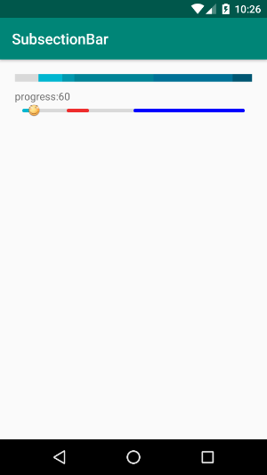
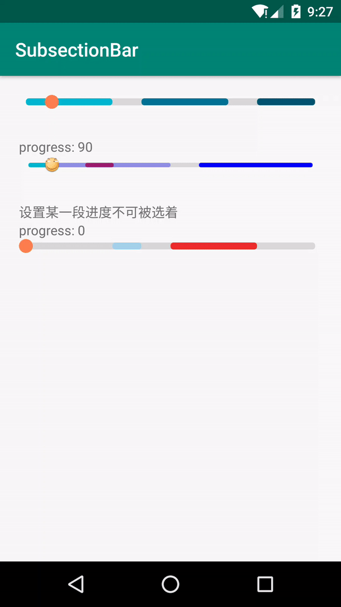

# SubsectionBar
Android 多背景色分段ProgressBar & 多背景色分段SeekBar
## 效果图
#### 静图


#### GIF
  

## 属性
```
<declare-styleable name="SubsectionSeekBar">
    <!--上限-->
    <attr name="max" />
    <!--导航按钮资源ID-->
    <attr name="seekBarResId" format="reference" />
    <!--背景条颜色-->
    <attr name="backgroundColor" format="color" />
    <!--第一个进度条颜色-->
    <attr name="progressColor" format="color" />
    <!--第二个进度条颜色-->
    <attr name="secondaryProgressColor" format="color" />
    <!--进度条高度比例 -->
    <attr name="ratio" format="integer" />
</declare-styleable>
```
